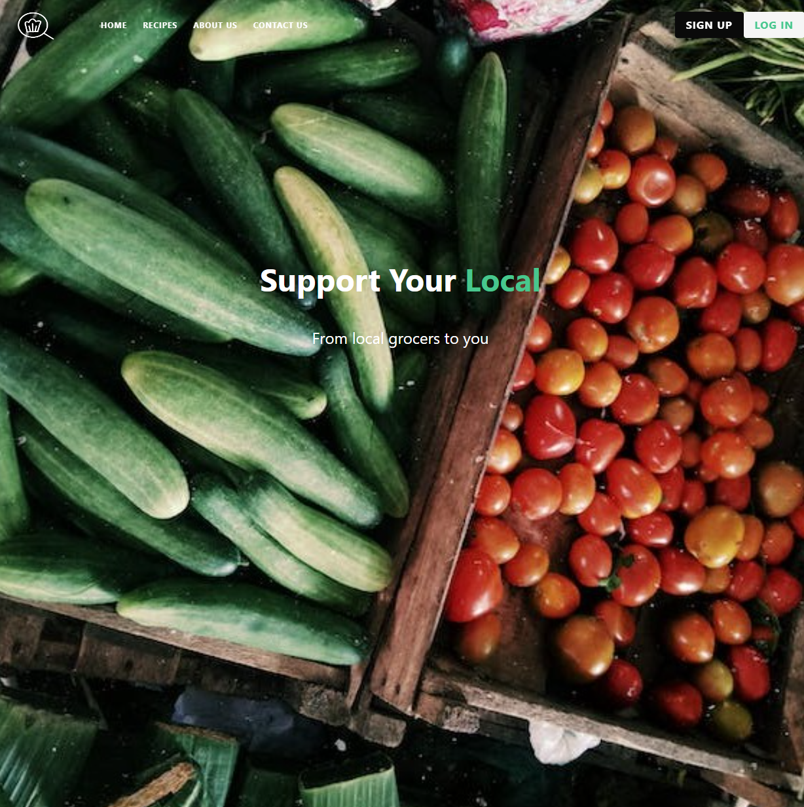
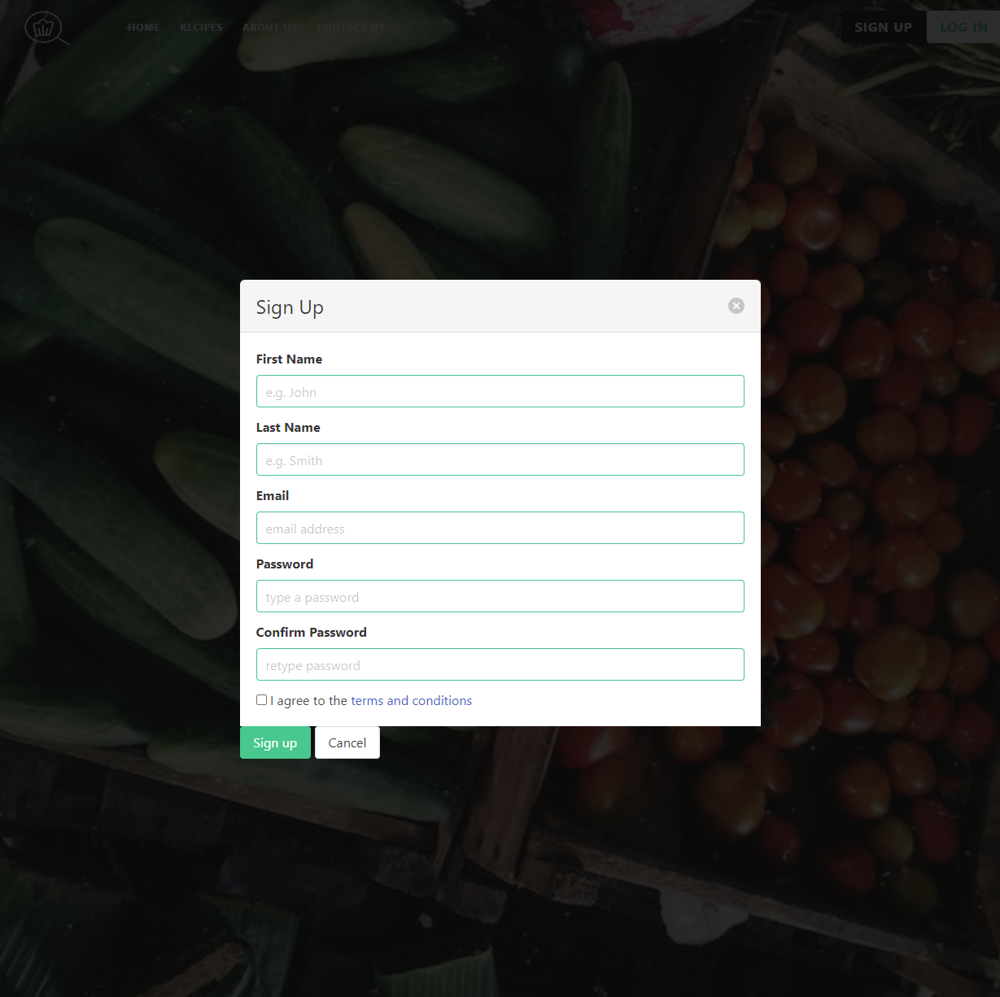
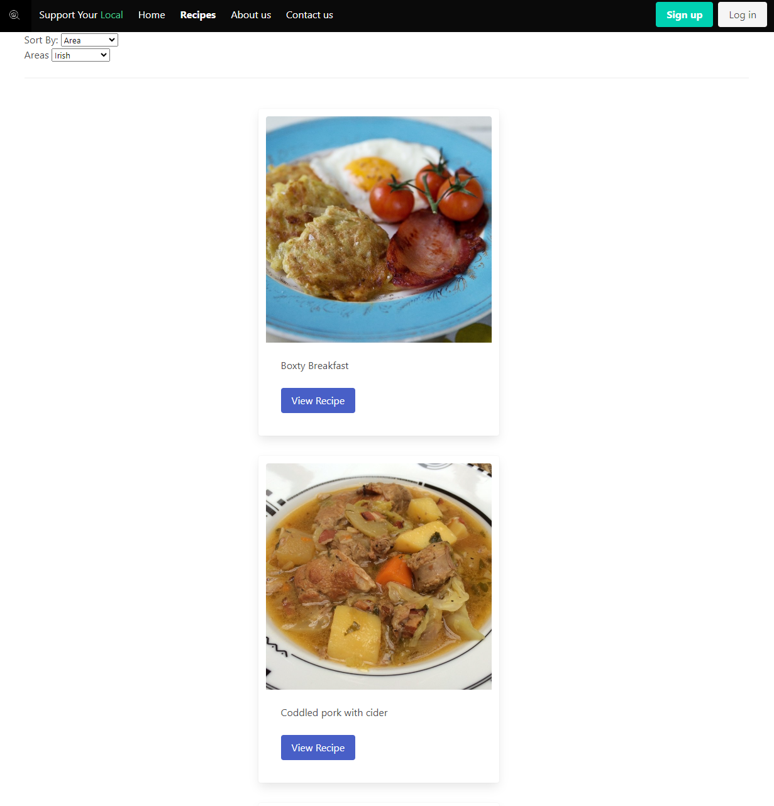

# Support-your-local

Bootcamp Project 1

## Description
The motivation for designing this app is the movement of community members towards local food shopping experiences at small businesses in their local communities and while on holidays. Shopping at small businesses has multiple benefits including personal well-being, community well-being and economic benefits for the local community. When on holidays, shopping at local food stores allows you to 'be a local' and enjoy a broader experience of being in this unfamiliar place.

The reason for designing this app is that small business owners have been left behind as the large supermarkets increase their hold on the market. Customers are often attracted to the large supermarkets through price cuts and efficiencies in one location for food items. Our app gives customers a more efficient way to find their food supplies at small businesses near their location. Using the third-party Google Maps API allows Google to choose a suitable route for the shopping trip, decreasing mental load of working out where to go and how to get there quickly.

The hold of large supermarkets is increasing with their ability to increase technologies that make food shopping even simpler. Online shopping has further increased the efficiency of food shopping with ordering online, deliveries and pick-ups.

While our app is currently customer-focused, a future direction for this app is to incorporate a business-side model to our app. This would include giving small business owners the opportunity to list their range of items in our database/API. Customers could then search for specific items they need and find stores that stock the items. Knowing that specific food items are in the range of small store items will alleviate the concern that "the small store won't have what I'm looking for and I would've wasted so much time". 

The problem 'Support Your Local' seeks to solve is the perceived lack of efficiency when shopping at small local food stores, like bakeries, butchers, fruit n veg shops and asian supermarkets.

Building this app together has taught us about the importance of project management. Breaking projects down into small tasks and managing the interactions between the tasks with good communication and regular updates and sharing of code. Communication when merging work and supporting each other to debug our code has helped our team be effective. Recognising each person's talents within the project was important, so that the team could stay motivated and work well together as a whole with each member feeling valued.

Interactions has been the concept most prominent during this project experience. The use of local storage as the connection for data between pages was very important. Interaction between the recipes API and the maps API was an important part of the main functionality of our app. This was challenging and we look forward to learning more about how this interaction could improve. 

## Table of Contents
- [Usage](#usage)
- [Credits](#credits)

## Usage
To use the 'Support Your Local' app, so to this link: *add link here*
 

Sign up and log in.

Explore the recipes page, searching with a variety of terms including area and ingredients. You will find  your latest viewed recipe awaiting you on reload, so, after shopping, you'll be ready to cook!

Use the search items to find places to buy the food items you need near your location. 

## Credits

Team members: 

Benji https://github.com/BenjiCullen
Andrea https://github.com/mopadeen 
Bowie https://github.com/BowieRC 
Amy https://github.com/AmyLloyd 

GoogleMaps API is a third-party API that we have used to create our main functionality.
Edamam recipes API is an additional API that supports the inspiration of cooking ideas, motivating people to cook and get excited about ingredients. 
Bulma tutorials were used often to support implementation of the framework.

