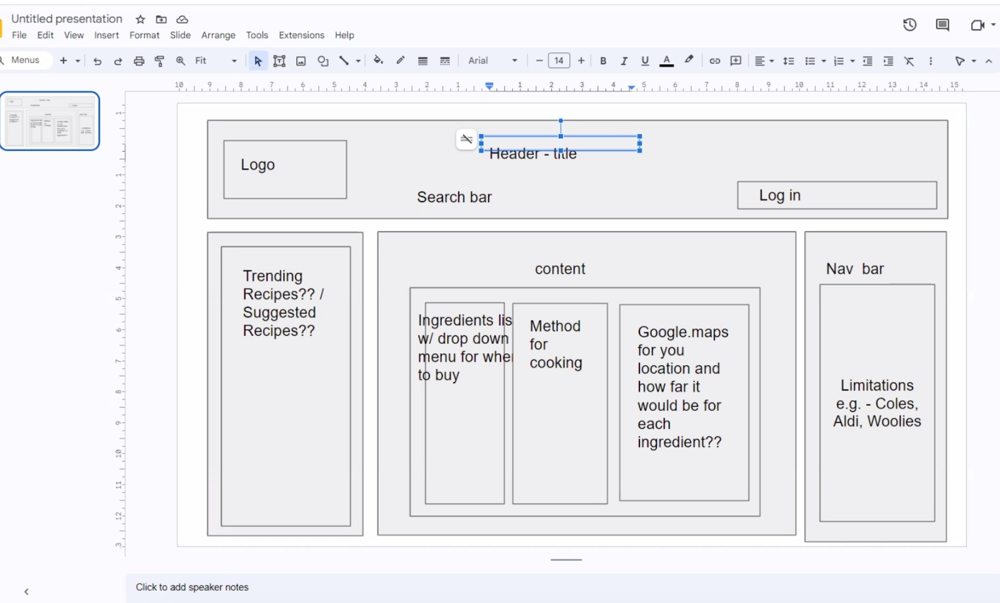

# SUPPORT YOUR LOCAL  

## User Story

```
AS A community-responsible consumer,
I WANT to be able to efficiently source my ingredients for recipes from local small businesses
SO THAT I can help local businesses thrive and feel proud of my community involvement.
```


### Mock-Up
---

The following wireframe demonstrates functionality:

  

## Acceptance Criteria for tasks


### Table of Contents 

- [Main functionality](#main-functionality)
- [Trending Recipes](#trending-recipes)
- [Log in](#log-in)
- [Site Navigation](#site-nav)

  
    


<a name="main-functionality"></a>

### Main functionality


GIVEN I am finding ingredients for my recipe  
WHEN I enter the type of dish I want to create  
THEN a list of optional recipes appears  
WHEN I select a recipe  
THEN I see an ingredients list and the method  
WHEN I see the ingredients list  
?THEN the ingredients are categorised into eg. butcher/bakery/local supermarket?  
WHEN I click on an ingredient   
THEN Google maps will show me the nearest location    

<a name="edamam-API"></a>

### Edamam API

<br>
<br>

<a name="maps API"></a>

### Maps API

<br>
<br>

<a name="HTML"></a>

### HTML Framework  

<br>
<br>

<a name="trending-recipes"></a>

### Trending Recipes

GIVEN I am interested in cooking  
WHEN I load the page  
THEN suggested recipes appear based on my previous search items  

**Tasks**
- Add HTML element with an anchor for dynamic elements created in javascript
- Retrieve previous search input from local storage
- Enter previous search input into Edamum API to retrieve 5 suggestions
- Dynamically add images to anchor element

<br>

<a name="log-in"></a>

### Log in 

GIVEN I want to use this app often  
WHEN I input my log in details   
THEN I see the page refresh (awaiting future backend functionality)

**Tasks**
- Add input field or modal? in HTML using Bulma
- Send data to local storage to see if it matches stored data
- Add javascript for refresh function and restore saved preferences from local storage
- Create modal to collect initial preferences and changes preferences like ?colour scheme

<a name="site-nav"></a>

<br>

### Site navigation

<br>
<br>

*Enter new ideas here* :)

<br>


[1] Markdown notes
- 'trailing whitespace' line breaks are created with two spaces and then press return at the end of a line or use <br>